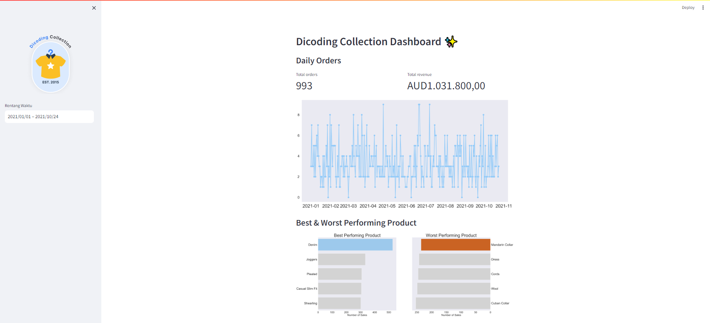
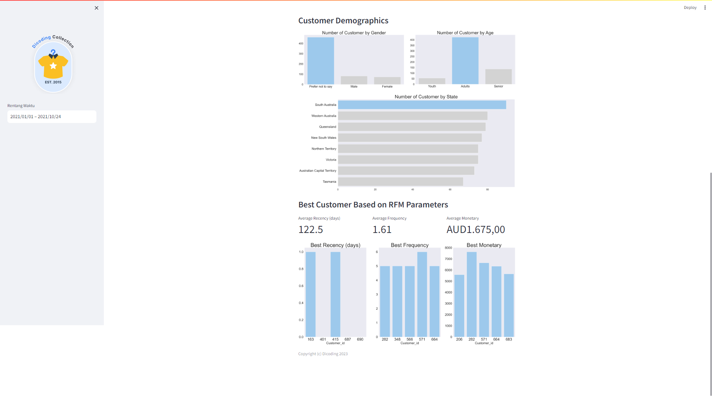

# dicoding-collection-dashboard 🌟:
Pengembangan dashboard dalam bidang analisis data menggunakan python. Adapun proses analisis data meliputi:
- Data wrangling
- Exploratory Data Analysis
- Data Visualization

# setup environment
```
conda create --name main-ds python=3.9
conda activate main-ds
pip install numpy pandas scipy matplotlib seaborn jupyter streamlit babel
```

# Run Streamlit App
```
streamlit run dashboard.py
```

# Contoh tampilan dashboard
Tampilan Order harian  
  

Tampilan demografi pelanggan dan Pelanggan terbaik berdasarkan analisis RFM

